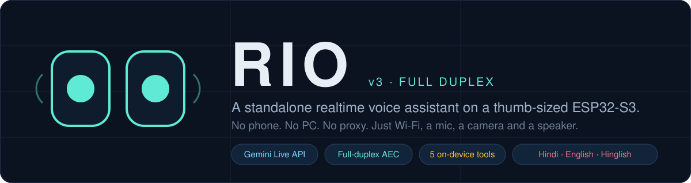
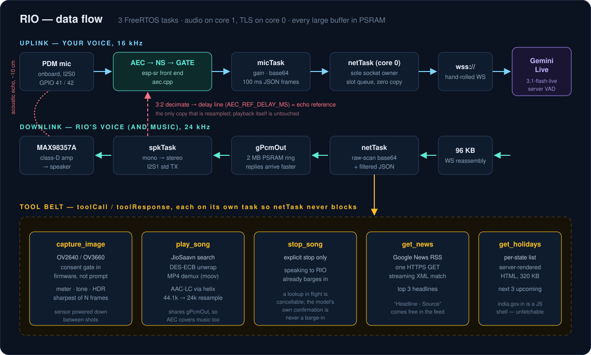
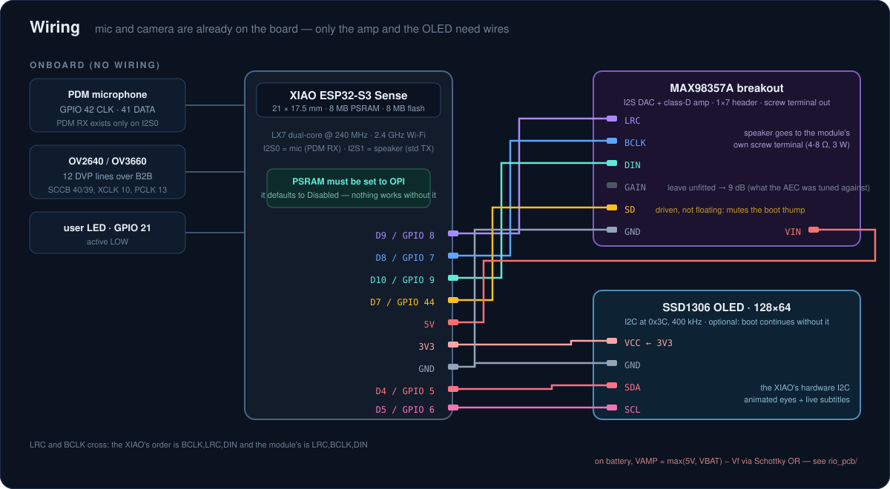
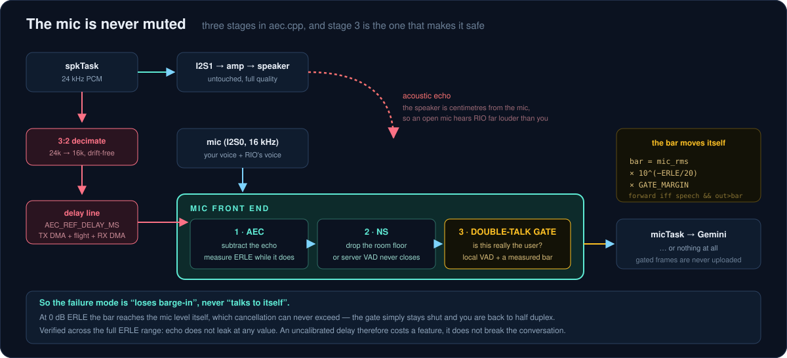
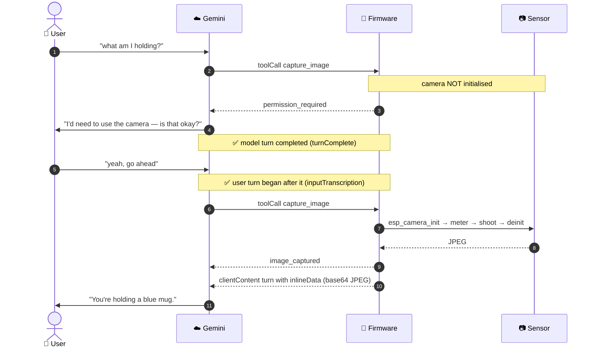
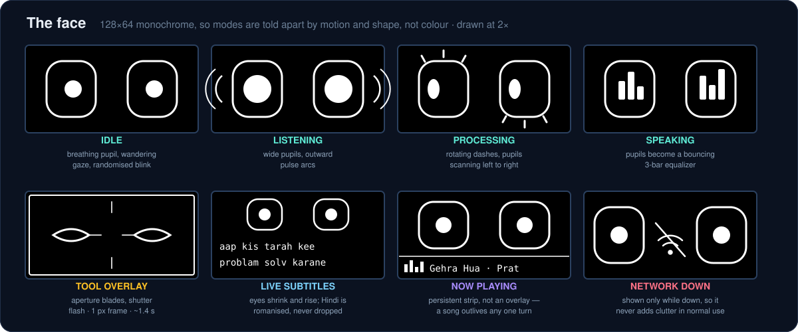
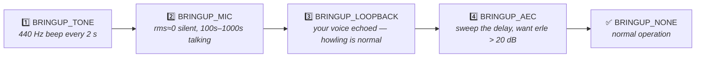

<div align="center">



<br>

[](https://documentation.espressif.com/esp32-s3_datasheet_en.pdf)
[](https://wiki.seeedstudio.com/xiao_esp32s3_getting_started/)
[](https://github.com/espressif/arduino-esp32)
[](https://ai.google.dev/gemini-api/docs/live-api)

[](#-full-duplex-the-mic-is-never-muted)
[](#-the-tool-belt)
[](#-what-a-session-looks-like)
[](#-the-face)
[](#4-board-settings-in-the-arduino-ide)

**Talk to it. It talks back. Nothing else is in the loop.**

RIO captures your voice on the board's own PDM microphone, streams it straight to the
**Google Gemini Live API** over `wss://`, and speaks the reply through a **MAX98357A**
amplifier — while the mic stays open, so you can cut it off mid-sentence.
It can also look at things with its camera, play you a song, read you the news,
and blink at you from a 128×64 OLED.

*No phone. No PC. No proxy of your own. Only Wi-Fi.*

</div>

---

## 📑 Table of contents

| | |
|---|---|
| [✨ Highlights](#-highlights) | [📷 The camera, and the consent gate](#-the-camera-and-the-consent-gate) |
| [🎬 What a session looks like](#-what-a-session-looks-like) | [🧰 The tool belt](#-the-tool-belt) |
| [🧠 How it works](#-how-it-works) | [👀 The face](#-the-face) |
| [🔩 Hardware](#-hardware) | [📁 Code map](#-code-map) |
| [🔊 Full duplex](#-full-duplex-the-mic-is-never-muted) | [🚀 Quick start](#-quick-start) |
| [🩺 Telemetry & troubleshooting](#-telemetry--troubleshooting) | [🔧 Tuning cheat sheet](#-tuning-cheat-sheet) |
| [🔒 Security & privacy](#-security--privacy) | [📚 References](#-references) |

---

## ✨ Highlights

|  | Feature | Why it's interesting |
|:--:|---|---|
| 🔌 | **Fully standalone** | The ESP32-S3 holds the TLS WebSocket itself. There is no companion app, no laptop bridge, no relay server. Power + Wi-Fi is the whole deployment. |
| 🎤 | **True full duplex** | The microphone is *never muted*, not even while RIO is talking. Barge in, talk over it, take the floor back — acoustic echo cancellation strips RIO's own voice out of the mic feed. |
| 🛡️ | **A gate that can't leak echo** | The double-talk gate raises its threshold from **measured** ERLE, so bad calibration costs you barge-in — it can never make RIO interrupt itself. |
| 📷 | **Camera with consent enforced in firmware** | The sensor stays *unpowered* until RIO has asked out loud and you have answered. The rule lives in C++, not in the prompt, so the model cannot talk its way past it. |
| 🎼 | **Music, decoded on-device** | Spoken song name → JioSaavn search → DES-ECB URL unwrap → MP4 demux → AAC-LC decode → resample → speaker. No ffmpeg, no helper PC. |
| 📰 | **News & holidays without an API key** | Google News RSS and a server-rendered holiday table, parsed on the microcontroller. |
| 👀 | **An actual face** | Animated robot eyes, live romanised subtitles and a now-playing strip on an SSD1306, driven by its own render task. |
| 🗣️ | **Hindi, English, Hinglish** | It replies in whatever you used, switching mid-conversation. |
| 🧵 | **3 tasks, 2 cores, 0 mutexes on the hot path** | One task owns the socket; state transitions are split so the two writers own disjoint edges and `compare_exchange` replaces locking. |
| 🔭 | **Staged bring-up** | Five bring-up modes, so a failure points at *one* subsystem instead of the whole stack. |

> [!NOTE]
> Every "MEASURED" number in this repo came off real hardware over a serial cable, not
> from a datasheet. [`CONTEXT.md`](CONTEXT.md) is the long-form engineering log — the
> reasoning, the dead ends, and the things that must not be re-derived.

---

## 🎬 What a session looks like

Boot, then just talk. There is **no wake word and no button** — turn-taking is Gemini's
server-side VAD.

```console
=================================================
 RIO — Gemini Live voice assistant
=================================================
[MEM] PSRAM available: 8386551 bytes
[MEM] pcm stream    2097152 bytes PSRAM
[MEM] img tx         524288 bytes PSRAM
[SPK] I2S1 STD TX live @ 24000 Hz on BCLK=7 WS=8 DOUT=9
[MIC] I2S0 PDM RX live @ 16000 Hz (3200 bytes in test read)
[AEC] AEC_MODE_FD_LOW_COST, nlp=AGGR, frame=256 samples, ref delay=90 ms (1440 samples)
[AEC] noise suppression mode 2, VAD mode 2, gate margin 2.0x over predicted echo
[WIFI] connected, IP 192.168.1.47, gateway 192.168.1.1, RSSI -52 dBm
[TIME] synced in 812 ms: Friday 12 September 2025, 18:04 IST
[WS] connecting to generativelanguage.googleapis.com:443 ...
[GEMINI] --> setup request: model=models/gemini-3.1-flash-live-preview voice=Zephyr resume=no time=synced
[GEMINI] setupComplete
[STATE] listening — say something

[YOU] क्या हाल चाल
[STATE] speaking
[RIO] सब बढ़िया! आप कैसे हैं?

[YOU] play gehra hua
[GEMINI] <-- toolCall play_song  query="gehra hua"
[GEMINI] --> toolResponse play_song: searching
[RIO] Playing it now.
[MUSIC] resolved to "Gehra Hua" (251 s)
[MUSIC] playing "Gehra Hua"  (http://aac.saavncdn.com/475/...._96.mp4)
[MP4] AAC-LC 44100 Hz 2 ch, 10824 frames, max frame 1093 B, resample step 1.837

[STAT] SPEAKING   erle=23dB gated=118 wifi=up rssi=-52dBm heap=94112/40960 min=61440
       psram=4812288 | stack mic=2104 spk=1560 net=4872 | drops=0 under=0 ovf=0
       recon=0 muted=0 amp=on
```

Ask it something that needs eyes and the camera negotiation kicks in:

```console
[YOU] what am I holding
[GEMINI] <-- toolCall capture_image
[CAM] permission requested — camera stays off until the user answers
[GEMINI] --> toolResponse capture_image: permission_required
[RIO] Should I take a look with the camera?
[YOU] yes go ahead
[GEMINI] <-- toolCall capture_image
[CAM] permission granted — powering up sensor
[CAM] settled after 4 frames: luma 121.4 wb 1.02/0.98 motion 2.4
[CAM] shot 1: 1600x1200 q10, 68412 B jpeg, sharpness 184  <- keeping
[CAM] capture pipeline took 1714 ms
[GEMINI] --> toolResponse capture_image: image_captured
[RIO] You're holding a blue mug.
```

---

## 🧠 How it works

<div align="center">

</div>

### Three tasks, pinned on purpose

Audio timing must not queue behind TLS, so the tasks are split across both cores:

| Task | Core | Prio | Owns | Stack |
|---|:--:|:--:|---|:--:|
| `micTask` | 1 | 5 | Capture → gain → AEC front end → base64 → JSON → hand a slot index to `netTask` | 6 KB |
| `spkTask` | 1 | 6 | `gPcmOut` ring → mono-to-stereo → I2S1, plus the amp mute/unmute window | 4 KB |
| `netTask` | 0 | 4 | **Sole owner of the WebSocket.** Send, poll, parse, service every tool call | 16 KB |
| `oledTask` | 1 | 1 | The only task that ever touches `Wire` | 4 KB |

`WiFiClientSecure` is not thread-safe, and a mutex would let a 4.4 KB TLS write stall the
receive path — so exactly one task touches the socket. `micTask` only *prepares* frames and
passes a **slot index** through a queue, so a 5 KB payload is never copied between tasks.

<details>
<summary><b>💡 Why a hand-rolled WebSocket client?</b> &nbsp;<i>(both alternatives were ruled out by measurement)</i></summary>

<br>

- **`Links2004/arduinoWebSockets`** hard-codes `WEBSOCKETS_MAX_DATA_SIZE (15 * 1024)` as a
  bare `#define` — not `#ifndef`-guarded, so no build flag can raise it — and closes the
  socket with code 1009 on anything larger. **Measured against Gemini Live:** the largest
  server message was **41,238 bytes**, **71 of 116 messages in a single reply exceeded
  15 KB**, and even a two-word *"Hello there."* produced an **18,128-byte** message. That
  library would fail on the shortest possible response.
- **`esp_websocket_client`** is an ESP-IDF managed component (`esp-protocols`) and is not
  shipped in the Arduino-ESP32 core.

So [`ws_client.cpp`](ws_client.cpp) is a minimal RFC 6455 client over `WiFiClientSecure`,
with a 96 KB reassembly buffer in PSRAM (`WS_RX_ASSEMBLY_BYTES`).

</details>

<details>
<summary><b>💡 Why the response parser makes two passes</b></summary>

<br>

Audio is extracted by a **raw byte scan**, not a JSON DOM — which is safe *precisely
because* base64 output can never contain `"` or `\`, so the closing quote of a `"data"`
value is unambiguous with zero escape tracking.

Control fields then go through ArduinoJson with a `Filter` that **omits `modelTurn`**, so
the real parser walks straight past a 40 KB base64 blob without ever allocating it.

Transcription text *can* contain `\"` — which is exactly why transcripts go through the
real parser and the audio does not.

</details>

<details>
<summary><b>💡 Why the buffers are the sizes they are</b> &nbsp;<i>(measured, not guessed)</i></summary>

<br>

| Buffer | Size | Reason |
|---|---|---|
| `PCM_STREAM_BYTES` | **2 MB** | Gemini streams replies *faster than real time* — one detailed answer returned **1,593,122 bytes** (33.2 s of 24 kHz audio) in about 20 s. A smaller ring blocks `netTask` and drops audio mid-sentence. |
| `WS_RX_ASSEMBLY_BYTES` | 96 KB | Largest observed server message was 41 KB; `ovf=` in `[STAT]` counts anything that would exceed this. |
| `IMG_TX_BYTES` | 512 KB | A UXGA JPEG plus its base64 expansion and JSON envelope. |
| `TX_SLOT_BYTES` × `TX_SLOT_COUNT` | 5 KB × 6 | One 100 ms mic chunk, base64'd, as JSON — six in flight. |
| `MUSIC_MOOV_MAX` | 256 KB | A 6-minute AAC track's `moov` box measured **63,283 bytes**. |
| `HOLIDAY_RX_MAX` | 320 KB | The rows wanted sit **past 175 KB** into a ~250 KB page, so it cannot stop early. |

All of them live in **PSRAM**, allocated once in `appStateBegin()`. They are deliberately
*never* freed: PSRAM is not the scarce resource (~4.8 MB stays free all session), and
churning half-megabyte blocks is what *creates* the fragmentation that makes a later
camera capture fail.

The scarce resource is **internal DRAM**. Measured: free internal heap fell to **676 bytes**
while the JioSaavn TLS handshake ran alongside the live Gemini session. Nothing crashed
that time, but 676 bytes is luck, not headroom — which is why
[`memmon.cpp`](memmon.cpp) exists and reports the **largest free block** (the number that
actually predicts failure) and lets an expensive operation *decline* instead of rebooting.

</details>

---

## 🔩 Hardware

<div align="center">

</div>

### Bill of materials

| # | Part | Notes |
|:--:|---|---|
| 1 | **Seeed Studio XIAO ESP32-S3 Sense** | 21 × 17.5 mm. Brings the PDM mic, the camera and **8 MB PSRAM** — all three are non-negotiable. |
| 2 | **MAX98357A breakout** | The purple 1×7-header module with a screw terminal. I2S DAC + class-D amp in one. |
| 3 | Speaker, 4–8 Ω / 3 W | Straight into the amp module's screw terminal. |
| 4 | **SSD1306 OLED, 128×64, I2C** | Optional — boot continues without it. |
| 5 | LiPo cell + JST-PH 2.0 | Optional, for untethered use. |

### Pin map

> Only the amplifier and the OLED need wires. The mic and camera are already on the board.

| Signal | XIAO pin | GPIO | Bus | Notes |
|---|:--:|:--:|---|---|
| PDM mic clock | *onboard* | 42 | I2S0 | Fixed by the Sense module |
| PDM mic data | *onboard* | 41 | I2S0 | **PDM RX only exists on I2S0** on the S3 |
| Speaker `BCLK` | D8 | 7 | I2S1 | → MAX98357A |
| Speaker `LRC` | D9 | 8 | I2S1 | → MAX98357A |
| Speaker `DIN` | D10 | 9 | I2S1 | → MAX98357A |
| Amp `SD` | D7 | 44 | GPIO | Shutdown / channel select — **driven, not floating** |
| OLED `SDA` / `SCL` | D4 / D5 | 5 / 6 | I2C | 0x3C @ 400 kHz |
| Status LED | *onboard* | 21 | GPIO | **Active LOW** |
| Camera `XCLK` | *B2B* | 10 | DVP | 10 MHz — see below |
| Camera `SIOD` / `SIOC` | *B2B* | 40 / 39 | SCCB | Sensor control |
| Camera `D0`–`D7` | *B2B* | 15,17,18,16,14,12,11,48 | DVP | 8-bit parallel |
| Camera `VSYNC`/`HREF`/`PCLK` | *B2B* | 38 / 47 / 13 | DVP | |

Nothing collides: the camera's 12 lines are all on the Sense B2B connector, clear of the
mic (41/42), the speaker (7/8/9), the amp mute (44), I2C (5/6) and the LED (21).

> [!WARNING]
> **D8/D9/D10 are also the XIAO's hardware SPI pins**, which the Sense board uses for its
> microSD slot. On this board the speaker and the SD card are mutually exclusive. Not an
> issue here — the SD card is unused.

### 🔇 Why the amp's `SD` pin is driven

`AMP_SD_PIN` is GPIO44 = **U0RXD**, whose level before firmware drives it is not
guaranteed, so the amplifier is uncontrolled for the whole boot window. The breakout makes
that worse: it carries its own **1 MΩ pull-up from SD to VIN**, and the MAX98357A has an
internal 100 kΩ pulldown — with GPIO44 floating that divider parks SD at **≈0.45 V**,
which is the *enabled* band, not shutdown. The firmware mutes around every silence
(`AMP_MUTE_ENABLE`, with a 6 ms unmute settle and a 250 ms linger so it isn't chattering),
and the carrier PCB adds a 10 kΩ resistor that overrides the module's pull-up so the amp
boots muted no matter what GPIO44 is doing.

### 🧩 Carrier PCB

A two-layer KiCad carrier that sockets both modules, Schottky-ORs USB 5 V with the LiPo so
the speaker keeps working on battery, and breaks out the OLED header — lives in
[`../rio_pcb/`](../rio_pcb/).

### 📸 The camera sensor: OV2640 *or* OV3660

Current XIAO Sense units ship an **OV3660** where older ones had an OV2640 (the OV2640 was
discontinued and quietly swapped). [`camera.cpp`](camera.cpp) asks the driver over SCCB
and adapts at runtime — **do not hard-code an assumption about which one is fitted.**

| | OV2640 | OV3660 |
|---|---|---|
| Max frame size | UXGA 1600×1200 | QXGA 2048×1536 |
| `set_ae_level` | ✗ not implemented → falls back to the DSP brightness offset | ✓ real AE bias |
| `set_denoise` / `set_sharpness` | ✗ NULL pointers | ✓ |
| Reset orientation | upright | ⚠️ **vertically flipped** |
| Autofocus | ✗ fixed focus | ✗ fixed focus |

<details>
<summary><b>⚠️ Three OV3660 settings that are not optional on this board</b></summary>

<br>

Get any of them wrong and you get the same misleading symptom — `NO-EOI - JPEG end marker
missing`, then `Failed to get frame: timeout`, then a capture that fails with no
indication why:

| Setting | Typical OV2640 value | **Needed here** | Why |
|---|---|---|---|
| `CAM_XCLK_HZ` | 20 MHz | **10 MHz** | 20 MHz is too fast for this sensor at high resolution over the Sense B2B connector; frames stop completing |
| PSRAM DMA mode | on | **off** (`CAM_PSRAM_DMA_MODE 0`) | DMAing straight into PSRAM overflows on the OV3660 |
| `fb_count` | 1 is fine | **2** | Single-buffering causes FB-OVF errors |

ESP-IDF projects set the PSRAM one with `CONFIG_CAMERA_PSRAM_DMA_MODE=n` at build time.
Arduino ships a *precompiled* driver, so `camera.cpp` calls the runtime
`esp_camera_set_psram_mode()` instead — immediately after init, because that call
reinitialises the camera and would discard any tuning applied before it.

**Cost:** 10 MHz roughly doubles frame time, which is why `CAM_TUNE_BUDGET_MS` is generous.
Once captures are reliably working, raising XCLK back to 20 MHz is the single biggest
latency win available — but revert it the moment timeouts reappear.

**The OV3660 also comes up upside down.** This is a sensor defect, not a mounting question:
its reset defaults leave it vertically flipped and oversaturated, and Espressif correct for
both in their own `CameraWebServer` reference. `camera.cpp` does the same, keyed on the PID
read over SCCB. Uncorrected, every frame reaches Gemini upside down — and upside-down text
is text the model often just misreads.
> `CAM_FLIP_VERTICAL` / `CAM_MIRROR_HORIZONTAL` are for **mounting** orientation and are
> XORed *on top of* that correction. Do **not** set `CAM_FLIP_VERTICAL 1` to "fix" an
> upside-down OV3660 — you will flip it back the wrong way.

</details>

---

## 🔊 Full duplex: the mic is never muted

<div align="center">

</div>

You can talk over a reply, cut RIO off mid-sentence, and take the floor back without
waiting. Gemini's server-side VAD emits `interrupted` the moment it hears you during a
model turn, and playback is flushed on the spot.

**The hard part is local, not remote.** The speaker is centimetres from the mic, so an open
mic hears RIO far louder than it hears you. Left alone, the VAD reads that as a barge-in
and *the assistant interrupts itself in a loop* — or decides you never stop talking and
stops taking turns at all.

### Stage 3 is what makes this safe rather than merely good when tuned

While RIO is audible, a frame is forwarded only if the local VAD calls it speech **and** it
stands clear of the echo predicted from the **measured** ERLE:

```c
bar = mic_rms × 10^(−ERLE/20) × AEC_GATE_MARGIN
forward only if  speech  AND  out_rms > bar
```

The bar is predicted from the *mic* level, not the reference, deliberately: the two are in
different domains (digital playback vs. whatever the acoustic path and mic gain deliver)
and the coupling between them is unknown. ERLE is *by definition* the mic-to-output ratio
during echo-only stretches, so this needs no coupling estimate at all.

| Measured ERLE | Behaviour |
|---|---|
| **≥ ~12 dB** | Your voice clears the bar → real barge-in, **full duplex** |
| **< ~12 dB** | Nothing clears it while RIO speaks → mic effectively muted, **half duplex** |
| **0 dB** (AEC dead) | The bar reaches the mic level itself, which cancellation can never exceed → the gate simply **stays shut** |

> [!IMPORTANT]
> So the failure mode is *"loses barge-in"*, **never** *"talks to itself"*. An uncalibrated
> or drifting delay costs a feature instead of breaking the conversation. Verified across
> the full ERLE range: echo does not leak at any value, including 0 dB.

`gate=shut` in the `[MIC]` line while RIO speaks is the system **working correctly**.
`gated=` in `[STAT]` counts the frames it refused.

Noise suppression (stage 2) earns its place beyond audio quality: a high room-noise floor
alone can hold Gemini's server-side VAD open permanently, which produces the failure where
transcripts keep arriving but the model never replies.

### 🎯 Calibrating `AEC_REF_DELAY_MS`

This is the one number that is **hardware-specific and must be measured**. It is the gap
between handing a sample to the I2S DMA and that sample turning up in a mic frame — and
arithmetic cannot settle it, because the two DMA queues do not sit at the same occupancy:

```
TX (audio_out.cpp)  4 desc × 360 frames @ 24 kHz =  60 ms ceiling — runs NEAR FULL
                                                    (i2s_channel_write blocks until DMA accepts)
RX (audio_in.cpp)   6 desc × 256 frames @ 16 kHz =  96 ms ceiling — runs NEAR EMPTY
                                                    (micTask consumes as fast as frames arrive)
acoustic flight     ~10 cm                        =  <1 ms
                                                     ------
                                       worst case  = 156 ms, true value well under it
```

So set `BRINGUP_MODE BRINGUP_AEC` in [`rio_assistant.ino`](rio_assistant.ino) and flash. It
sweeps 0–600 ms by itself in about a minute and prints a table. **Stay silent and still** —
your voice would be scored as failed cancellation.

```console
   delay_ms   erle_dB   mic_rms   out_rms
   --------   -------   -------   -------
         80      19.6      4210      1020
         90      21.8      4198       340   <-- best so far
        100      24.1      4205       262   <-- best so far
        120      15.2      4211       730

  BEST: AEC_REF_DELAY_MS = 100   (erle 24.1 dB)
  Healthy. Put that value in config.h, set BRINGUP_NONE.
```

Broadband noise is used rather than a tone on purpose: an adaptive filter converges on
whatever excites it, and a single sine tells you almost nothing about how it will behave on
speech.

| ERLE result | What to do |
|---|---|
| **> 20 dB** | Healthy. Full duplex will work. |
| 10–20 dB | Marginal. Keep `START_SENSITIVITY_LOW`; try `AEC_MODE_FD_HIGH_PERF`. |
| **< 10 dB** | Full duplex will not work. Usually **mechanical** coupling — decouple the speaker from the board, or set `FULL_DUPLEX 0`. |

`erle=` also appears in the `[STAT]` line during normal operation, so you can confirm it
holds up under real conditions. **Change `dma_desc_num` / `dma_frame_num` in either file and
you must measure again** (shrinking them also cuts conversational latency, which is the
reason to consider it).

> **Symptom of getting it wrong:** `erle` near 0 dB, and RIO's own sentences coming back as
> `[YOU]` transcripts a moment after it says them:
> ```
> [RIO] मुझे आपके हाथ में कुछ दिख नहीं रहा, बस आपका चेहरा
> [YOU] मुझे आपके हाथ में कुछ दिख नहीं रहा। बस आपका चेहरा
> ```

If you cannot get usable ERLE on your unit, `FULL_DUPLEX 0` restores the half-duplex path
unchanged — the mic is muted for the whole reply plus a 300 ms tail. It cannot self-trigger,
at the cost of barge-in.

---

## 📷 The camera, and the consent gate

RIO never takes a picture on its own initiative. The camera is exposed to the model as a
single no-argument tool, `capture_image`, and **the sensor stays unpowered** until a request
has been asked aloud *and* answered.



### The gate is enforced in firmware, not by the prompt

The **first** call for any request is refused unconditionally. A later call is honoured only
if two things happened since, **in order**:

1. the model **finished a turn** (`serverContent.turnComplete`) — it actually *asked*,
   rather than calling the tool twice in a row; **and**
2. the user **began a turn** after that (a new `inputTranscription`) — they actually *said*
   something back.

Requiring the user turn to follow the model's turn boundary is what stops a late-arriving
transcription fragment from the *original* question being mistaken for an answer to a
question that had not been asked yet. A grant is consumed by exactly one capture; the next
request re-arms the gate from scratch. `[CAM] still refused (asked=0 answered=1)` in the log
is the gate working as designed — the model tried to reuse an old turn as consent.

> [!NOTE]
> **Known limitation.** The firmware guarantees a question was asked and answered; it does
> not judge *what* the answer was. Deciding that "no, don't" is a refusal is left to the
> model. If you want a consent signal the model cannot misread, the honest version is a
> physical button, not a spoken yes.

### Order of operations matters

The photo is a `clientContent` turn sent **after** the tool call is answered, and both
halves of that are load-bearing:

- `realtimeInput.video` is what the Live API documents for camera input, and the server
  accepts it *silently* — but the model never puts those frames in context. It answers as
  though a photo arrived and **describes a scene it invented**.
- Opening the image turn *before* answering the call fails differently: the turn is
  accepted and the model then **stays silent** for the rest of the exchange.

Answer first, then send the photo as its own complete turn.

### What a capture costs, and why

Tearing the sensor down after every shot **is** the privacy guarantee — and the bill for it
is that the sensor's automatic loops get no history: AE, AGC and AWB start cold every single
time, with one frame's worth of scene to converge on. A blind grab under those conditions
comes out dark, colour-cast, or both. So a capture is not a grab; it is a short, measured
convergence:

| Phase | What it does | Cost |
|---|---|---|
| **init** | Sensor up at the largest frame size that actually *streams* — UXGA → XGA → SVGA → VGA, each proved with a probe frame before it is accepted | ~200–400 ms |
| **settle** | Decode each frame at 1/8 scale; loop until brightness, **colour** and **stillness** all agree on two consecutive frames | 3–10 frames |
| **trim** | Bias exposure toward a target a vision model can actually read — the sensor's own AE aims darker | 0–2 frames |
| **tone** | Classify the scene (high-range / dark / flat) and reshape gamma, contrast and gain ceiling to fit it into 8 bits | free (sensor DSP) |
| **bracket** | On contrasty or dark scenes, try darker exposures and keep the one that clips the fewest **highlights** | 0–2 small frames |
| **focus** | Autofocus, if the sensor has a lens that can — neither stock sensor does | 0 ms |
| **shoot** | `CAM_SHOT_CANDIDATES` full-res frames, keep the **sharpest**; re-shoot coarser if one would not fit `IMG_TX_BYTES` | ~250 ms each |

Everything between init and the shutter is best-effort and bounded by `CAM_TUNE_BUDGET_MS`;
the shutter has its own `CAM_SHOT_BUDGET_MS`. When either clock runs out the pipeline shoots
with whatever it has: **a slightly mis-exposed answer now beats a perfect one after RIO has
already gone quiet waiting.** Total is typically 1.5–2 s.

<details>
<summary><b>💡 Two phases exist specifically to stop bad frames reaching the model</b></summary>

<br>

A bad frame does not fail cheaply — it costs a wrong answer *plus* the whole spoken round
trip to ask again.

- **Colour convergence.** AWB settles noticeably later than AE, so a frame grabbed the
  moment brightness stops moving is routinely still colour-cast — the difference between
  *"the cable is blue"* and *"the cable is grey"*. The settle loop watches the R/G and B/G
  channel ratios alongside luma. Free: the ratios come out of thumbnails it is already
  decoding.
- **Blur rejection, in two layers.** An 8×8 luma grid diffed between consecutive thumbnails
  gives a motion estimate, and the settle loop refuses to commit while the scene is moving
  (free, same thumbnails). That covers the metering window but not the gap between it and
  the shutter — so the shutter itself takes `CAM_SHOT_CANDIDATES` frames and keeps the one
  with the highest **variance of the Laplacian** at 1/4 scale. This one is *not* free
  (~400 ms for the default of 2); set `CAM_SHOT_CANDIDATES 1` to disable it.

The only per-frame CPU work is decoding thumbnails. Every actual image adjustment happens
inside the sensor's ISP on the way to its **hardware** JPEG encoder, so `netTask` is never
blocked doing arithmetic over a full-resolution image.

</details>

<details>
<summary><b>💡 Why metering runs at full resolution (and why "auto HDR" is not exposure fusion)</b></summary>

<br>

The obvious optimisation is to meter at VGA and only pay for UXGA on the frame that gets
sent. **It does not work, and it fails expensively** — recorded here so nobody re-derives it:

`esp_camera_init()` is the only caller of `cam_config()`, which sizes the DMA descriptor
chain and the frame buffers. Calling the sensor's `set_framesize()` afterwards changes what
the *sensor* emits while the driver's DMA layout stays where init left it. Going *down* is
survivable — fewer bytes than the DMA expects. Coming back *up*, frames stop completing
altogether and every `esp_camera_fb_get()` burns its full ~4 s timeout returning `NULL`.
Three of those in a row is a **12-second hole in the conversation** and a `capture_failed`.
`esp_camera_reconfigure()` is the supported way, but it is a deinit/init underneath: it
resets the sensor and discards every exposure and tone setting the metering just worked out.

So the pipeline picks one resolution at init and stays there.

**On "auto HDR":** this is not multi-frame radiance fusion. Merging exposures would mean
decoding two full UXGA frames to RGB888 (1.4 MB each), fusing, and re-encoding JPEG *in
software* — over a second of CPU, throwing away the hardware encoder that makes this board
viable at all. What the pipeline does instead is the half that actually matters on a
fixed-lens 8-bit sensor: measure the real dynamic range, pick the exposure that clips the
fewest **highlights** (blown highlights are gone for good; crushed shadows are partly
recoverable — hence the 3:1 scoring weight), and reshape the sensor's own tone curve to fit
that range. Steps two and three cost no CPU at all.

**Every `sensor_t` setter is called through a null-checking macro**, because `esp32-camera`
leaves the ones a given sensor does not implement as NULL, and calling through one is an
instant `StoreProhibited` panic mid-capture.

</details>

---

## 🧰 The tool belt

Five function declarations go out in the setup message. Each one that can block runs on
**its own FreeRTOS task**, because `netTask` owns the WebSocket and must keep polling it —
a search is seconds and a song is minutes. That is also why the slow tools answer
`"searching"` rather than reporting success: nothing is known yet at the moment the answer
is due. Anything that emerges later comes back as a spoken note via `*TakeNotice()`.

| Tool | Args | Source | Answers | Notes |
|---|---|---|---|---|
| 📷 `capture_image` | — | Onboard OV2640/OV3660 | `permission_required` → `image_captured` | Consent gate in firmware; sensor powered down between shots |
| 🎵 `play_song` | `query` | JioSaavn | `searching` | Replaces whatever is playing |
| ⏹️ `stop_song` | — | — | immediate | Only for an explicit stop — talking already barges in |
| 📰 `get_news` | `query` | Google News RSS (`hl=en-IN`) | `searching` → top 3 headlines | |
| 🗓️ `get_holidays` | `state` | Simpliance state holiday list | `searching` → next 3 upcoming | Defaults to `HOLIDAY_DEFAULT_STATE` |

<details>
<summary><b>🎵 play_song — the whole pipeline, on the microcontroller</b></summary>

<br>

```
"play gehra hua"
   │
   ├─ jiosaavn.cpp   ONE HTTPS request: search.getResults&n=1  (~34 KB)
   │                 encrypted_media_url already present at byte ~677,
   │                 so the song.getDetails round trip is not needed
   │
   ├─ des_ecb.cpp    base64 → DES-ECB under the published key "38346591"
   │                 → https://aac.saavncdn.com/475/<hash>_96.mp4
   │
   ├─ (plain HTTP)   that CDN host also answers on port 80 with
   │                 Accept-Ranges: bytes — so the multi-MB transfer
   │                 costs no second TLS session. Only the lookup is TLS.
   │
   ├─ mp4aac.cpp     demux `moov` (it sits BEFORE `mdat` — 63,283 B at
   │                 offset 28 on a 6-min track, so one forward pass on a
   │                 socket that cannot seek), then AAC-LC via libhelix,
   │                 then resample 44.1 kHz stereo → 24 kHz mono
   │
   └─ gPcmOut        the same ring Gemini's speech uses — so spkTask, the
                     I2S path AND the AEC reference all work unchanged,
                     which means echo cancellation covers music too
```

**Why this is tractable at all** (all measured on `aac.saavncdn.com`):

- Every bitrate is plain **AAC-LC** (`audioObjectType 2`) — no SBR, no PS, so libhelix
  decodes it without the HE-AAC paths it does not have.
- `moov` sits **before** `mdat`, so the tables can be read in one forward pass.
- AAC frames fill `mdat` **contiguously** — `sum(stsz) == mdat` payload exactly — which is
  why nothing reads `stsc` or `stco`: with no gaps to skip, the frame sizes alone walk the
  whole track. (MP4 stores raw AAC blocks with no ADTS headers, so there is no sync word to
  hunt for; the decoder runs in raw mode via `AACSetRawBlockParams()`.)

**`DES` is not here for security.** DES is broken, the key is a published constant of the
service, and the whole construction is obfuscation. It is implemented because a URL arrives
wrapped in it — and it lives in [`des_ecb.cpp`](des_ecb.cpp) rather than calling mbedtls
because ESP-IDF builds mbedtls with `MBEDTLS_DES_C` switched **off**, so
`mbedtls_des_crypt_ecb()` compiles cleanly and then fails at *link*.

**One subtlety worth keeping:** `musicIsPlaying()` is distinct from `musicIsActive()`. A
lookup takes seconds, and during those seconds the model is busy saying *"playing it now"* —
treating that confirmation as a barge-in cancels the very song it is confirming, which is
exactly what happened before the distinction existed.

</details>

<details>
<summary><b>📰 get_news / 🗓️ get_holidays — the "page vs. real feed" problem, twice</b></summary>

<br>

**News.** The browser page at `news.google.com/search?q=…` is JS-rendered, but the same
query is served as XML at `news.google.com/rss/search?q=…&hl=en-IN&gl=IN&ceid=IN:en`. One
HTTPS GET returns the top results most-relevant-first, and each `<title>` is already in
`"Headline - Source"` form — so no separate source lookup is needed.

**Holidays.** `india.gov.in/calendar` cannot be used at all: it is a client-rendered
Next.js app whose initial HTML carries **zero** holiday text, only a JS shell that fetches
the list after the page loads in a browser. Simpliance's per-state labour-law list is
genuinely server-rendered — every row carries `data-holiday-name` / `-date` / `-type`
attributes in the plain HTML, which is what makes it fetchable by firmware.

That page lists a whole calendar year chronologically, and the rows that matter can sit
**past 175 KB** into a ~250 KB response — so unlike the news feed this one buffers the
response in full (`HOLIDAY_RX_MAX` = 320 KB) instead of stopping early.

</details>

<details>
<summary><b>⏱️ Session length and recycling</b></summary>

<br>

Google documents audio-only Live sessions as much longer-lived than audio+video ones (the
latter around 2 minutes). RIO sends **stills on demand** rather than streaming video, so it
should not be treated as a video session — but if sending a frame does re-classify it,
expect `goAway` earlier than `SESSION_RECYCLE_MS` (8 min). That path is already handled:
`goAway` recycles at the next **turn boundary**, and the session-resumption handle carries
the conversation across. Watch `recon=` in `[STAT]`.

Context is kept in bounds server-side with `contextWindowCompression` (trigger 104,857
tokens → sliding window 52,428).

</details>

---

## 👀 The face

<div align="center">

</div>

All drawing happens on **one dedicated task**. Nothing in [`oled_display.h`](oled_display.h)
touches `Wire` from the caller's thread and none of it blocks on an I2C transaction — the
API only stamps shared state under a short mutex, so `micTask`, `spkTask`, `netTask` and
`loop()` can all call it concurrently.

Two concepts, matching the conversation model:

- **MODE** — an ongoing condition, persists until changed.
- **TOOL** — a one-shot overlay, ~1.4 s, then the current mode reappears by itself. A mode
  change *during* an overlay is not lost: the mode is stored immediately and simply becomes
  visible when the overlay ends.

The panel is monochrome, so modes are told apart by **motion and shape** instead of colour,
and a 1 px frame around the screen marks an overlay in place of an accent hue.

| Mode | Look |
|---|---|
| `OLED_MODE_IDLE` | Breathing pupil, wandering gaze, randomised blink |
| `OLED_MODE_LISTENING` | Larger pupils + outward pulse arcs |
| `OLED_MODE_PROCESSING` | Rotating dashes + pupils scanning left-right |
| `OLED_MODE_SPEAKING` | Pupils replaced by a bouncing 3-bar equalizer |

| Overlay / strip | Look |
|---|---|
| `OLED_TOOL_IMAGE` | Aperture blades spinning open |
| `OLED_TOOL_CAPTURE` | Full-screen flash + shutter squeeze |
| `OLED_TOOL_MUSIC` / `OLED_TOOL_PLAY` | Small pulsing equalizer / pupil morphing into a play triangle |
| **Now playing** | A *persistent* bottom strip with its own equalizer and scrolling title — a song runs for minutes while the conversation carries on around it, so it is not a tool event. A live caption outranks it; the strip returns when the caption expires. |
| **Network down** | A small crossed-Wi-Fi glyph between the eyes. Nothing is drawn while up, so it never adds clutter in normal use. |

### 🔤 Why Hindi appears romanised

Gemini streams transcripts in fragments (`"Kya"`, `" haal"`, `" chaal?"`), so subtitles
append, word-wrap, and keep the last two lines on screen. The eyes shrink and rise to make
room, then drop back.

Adafruit_GFX has a 5×7 ASCII font and **no text-shaping engine**, so Devanagari glyphs
cannot be drawn at any font size — matras and conjuncts need shaping the library does not
do. Devanagari is therefore **romanised rather than dropped**, so a Hindi reply reads as
Hinglish on the panel and matches what the serial log prints in script:

```
log      [RIO] आप किस तरह की प्रॉब्लम सॉल्व करने की कोशिश कर रहे हैं
caption  aap kis tarah kee problam solv karane kee koshish kar rahe hain
```

Any other script still collapses to a space. The eyes animate the same way either way.

---

## 📁 Code map

| File | Role |
|---|---|
| [`rio_assistant.ino`](rio_assistant.ino) | `setup()`/`loop()`, task creation, bring-up modes, LED, telemetry |
| [`config.h`](config.h) | **Everything tunable**: pins, audio format, buffer sizing, AEC/VAD/camera/tool parameters, the Gemini endpoint and the system prompt |
| [`secrets.h`](secrets.h) | Wi-Fi credentials, Gemini API key, pinned root CAs — ships as a **template**, [fill it in first](#2-credentials--fill-in-secretsh-before-the-first-flash) — 🚫 *not for version control* |
| [`app_state.*`](app_state.cpp) | Shared PSRAM buffers/queues and the `ConvState` machine |
| [`audio_in.*`](audio_in.cpp) | I2S0 PDM mic capture, gain, RMS |
| [`audio_out.*`](audio_out.cpp) | I2S1 standard-mode TX to the MAX98357A, amp mute window |
| [`aec.*`](aec.cpp) | Mic front end: echo cancellation, noise suppression, local VAD, the double-talk gate, the 24→16 kHz reference decimator and its delay line |
| [`camera.*`](camera.cpp) | On-demand JPEG capture — powers the sensor up and back down around each shot and runs the metering / AE / auto-HDR / sharpness convergence in between |
| [`wifi_mgr.*`](wifi_mgr.cpp) | Connect + reconnect with exponential backoff |
| [`ws_client.*`](ws_client.cpp) | Minimal hand-rolled RFC 6455 WebSocket over TLS |
| [`gemini_live.*`](gemini_live.cpp) | Live API session setup, message framing, audio in/out encoding, tool-call dispatch, the camera permission gate |
| [`music.*`](music.cpp) | `musicTask`: song request queue, streaming, barge-in interaction |
| [`jiosaavn.*`](jiosaavn.cpp) | Song-name → playable URL, in one request |
| [`mp4aac.*`](mp4aac.cpp) | MP4 demux + AAC-LC decode + resample (the work ffmpeg used to do) |
| [`des_ecb.*`](des_ecb.cpp) | Single-block DES-ECB, for `encrypted_media_url` and nothing else |
| [`news.*`](news.cpp) | `newsTask`: Google News RSS lookup |
| [`holiday.*`](holiday.cpp) | `holidayTask`: per-state public holiday lookup |
| [`oled_display.*`](oled_display.cpp) | The face: eyes, subtitles, now-playing strip, status log |
| [`memmon.*`](memmon.cpp) | Internal-heap reporting and **admission control** |
| [`b64.*`](b64.cpp) | mbedtls base64 wrappers for PCM ↔ JSON |
| [`CONTEXT.md`](CONTEXT.md) | Long-form engineering log: measurements, rejected designs, and why |

---

## 🚀 Quick start

### 1. Dependencies

| Requirement | Verified with | Why |
|---|---|---|
| **Arduino-ESP32 core 3.x** | 3.3.11 | Not optional — [`audio_in.h`](audio_in.h) uses the ESP-IDF 5.x `driver/i2s_pdm.h`, which **does not exist** in core 2.x |
| **ArduinoJson** ≥ 7.0 | 7.4.3 | Filtered parsing of control fields |
| **Adafruit SSD1306** + **Adafruit GFX** | — | The OLED face |
| **arduino-libhelix** | — | `AACDecoderHelix.h`, for AAC-LC decode |

`esp_camera.h`, `esp-sr` (AEC/NS/VAD), `WiFiClientSecure` and `mbedtls` all ship with the
core — nothing extra to install.

### 2. Credentials — fill in `secrets.h` before the first flash

[`secrets.h`](secrets.h) ships as a **template**. The three values in it are placeholders, and
RIO cannot join a network or open the Live API session until you replace them with your own.
Nothing else in the repo has to be edited to get a first boot.

```c
#define WIFI_SSID       "YOUR_WIFI_SSID"
#define WIFI_PASSWORD   "YOUR_WIFI_PASSWORD"

#define GEMINI_API_KEY  "YOUR_GEMINI_API_KEY"
```

| Value | Where to get it | Watch out for |
|---|---|---|
| `WIFI_SSID` / `WIFI_PASSWORD` | Your router, exactly as typed on a phone | **2.4 GHz only** — the ESP32-S3 has no 5 GHz radio, so a 5 GHz-only SSID is never found. One name across both bands is fine; a split network means using the 2.4 GHz name. For an open network leave the password as `""`. |
| `GEMINI_API_KEY` | [aistudio.google.com/apikey](https://aistudio.google.com/apikey) → **Create API key** | Paste the whole string. It must belong to a project with the Generative Language API enabled — it is sent as `?key=…` on the WebSocket URL ([`gemini_live.cpp`](gemini_live.cpp)). |

These are C string literals, so keep the quotes and keep each one on a single line. A password
containing a `"` or a `\` has to be escaped (`\"`, `\\`); everything else, including `@` and
spaces, goes in as-is.

> [!NOTE]
> **The three PEM blocks further down the file are not yours to fill in.** They are the
> published root certificates that RIO pins as trust anchors — GTS Root R1 for Gemini,
> DigiCert Global Root G3 for the JioSaavn lookup, Amazon Root CA 1 for the holiday lookup.
> They are public, identical for everyone, and required for TLS to verify anything. Leave them
> alone. The only reason to touch one is a service changing CAs or a root expiring (2036 /
> 2038), which shows up as a TLS handshake failure against that one host.

**Keep the file out of version control.** Before the first commit:

```bash
echo 'secrets.h' >> .gitignore
```

A key that has been pushed once is leaked whether or not it is deleted afterwards — **rotate
it** at the console above rather than removing the commit.

**Confirming it worked.** On the serial monitor at 115200 baud a good boot reads:

```console
[WIFI] connected, IP 192.168.1.47, gateway 192.168.1.1, RSSI -52 dBm
[GEMINI] setupComplete
[STATE] listening — say something
```

- Stuck before `[WIFI] connected` → SSID, password, or the 2.4 GHz point above.
- `[WS] upgrade rejected: …` followed by a `[WS] body:` line → the API key. The body carries
  Google's own reason (a bad key, or the API not enabled on that project).

### 3. Wiring

```
MAX98357A            XIAO ESP32-S3 Sense          SSD1306 OLED
  VIN   ◀────────────  5V                           VCC  ◀──  3V3
  GND   ◀────────────  GND                          GND  ◀──  GND
  BCLK  ◀────────────  D8  (GPIO 7)                 SDA  ◀──  D4 (GPIO 5)
  LRC   ◀────────────  D9  (GPIO 8)                 SCL  ◀──  D5 (GPIO 6)
  DIN   ◀────────────  D10 (GPIO 9)
  SD    ◀────────────  D7  (GPIO 44)
  GAIN      leave unfitted → 9 dB
```

Leave `GAIN` alone: 9 dB is what the AEC was tuned against, and changing it invalidates that
tuning. (Bridging `GAIN` to GND gives 12 dB if you really need the volume — then re-measure
ERLE.)

### 4. Board settings in the Arduino IDE

Pick **Tools → Board → esp32 → XIAO_ESP32S3** — *not* "ESP32S3 Dev Module". The XIAO
profile sets flash size, partition scheme and USB CDC correctly on its own; the generic Dev
Module profile defaults to 4 MB flash, which is wrong for this board and leaves the sketch
squeezed into a 1.3 MB app partition instead of 3.3 MB.

| Setting | Value |
|---|---|
| **PSRAM** | **OPI PSRAM** ← 🚨 *defaults to Disabled; nothing here works without it* |
| Partition Scheme | 8 M with spiffs (3 MB app / 1.5 MB SPIFFS) |
| Flash Size | 8 MB (64 Mb) |
| USB CDC On Boot | Enabled |
| CPU Frequency | 240 MHz |
| Serial Monitor | **115200** baud |

With `arduino-cli` the PSRAM setting is part of the FQBN:

```bash
arduino-cli compile --fqbn esp32:esp32:XIAO_ESP32S3:PSRAM=opi
arduino-cli board list                       # find the port
arduino-cli upload -p /dev/cu.usbmodemXXXX --fqbn esp32:esp32:XIAO_ESP32S3:PSRAM=opi
arduino-cli monitor -p /dev/cu.usbmodemXXXX -c baudrate=115200
```

If the port doesn't appear, double-tap **RESET** to enter the bootloader.

### 5. Bring up one layer at a time

Set `BRINGUP_MODE` at the top of [`rio_assistant.ino`](rio_assistant.ino) and work down the
list. A failure then points at one subsystem instead of the whole stack.



| Mode | Proves | Expect |
|---|---|---|
| `BRINGUP_TONE` | Speaker wiring + I2S1 | 440 Hz beep every 2 s |
| `BRINGUP_MIC` | Mic + I2S0 PDM | `rms=` near 0 in silence, hundreds–thousands when speaking |
| `BRINGUP_LOOPBACK` | Both directions | Your voice echoed back (howling is **expected**) |
| `BRINGUP_AEC` | Echo cancellation | `erle` > 20 dB — [see calibration](#-calibrating-aec_ref_delay_ms) |
| `BRINGUP_NONE` | — | Normal operation |

> `BRINGUP_AEC` is **not optional** if you are running full duplex: an uncalibrated
> `AEC_REF_DELAY_MS` is the difference between natural conversation and RIO interrupting
> itself continuously.
>
> `BRINGUP_MIC` is also how you tune `MIC_GAIN_FACTOR`. If quiet-room RMS is already high,
> lower it — Gemini's VAD will otherwise trigger on room noise.

---

## 🩺 Telemetry & troubleshooting

A `[STAT]` line prints every 10 s:

```console
[STAT] LISTENING  erle=23dB gated=118 wifi=up rssi=-52dBm heap=94112/40960 min=61440
       psram=4812288 | stack mic=2104 spk=1560 net=4872 | drops=0 under=0 ovf=0
       recon=0 muted=0 amp=on
```

| Field | Watch for |
|---|---|
| `erle=` | Should hold near your calibrated value. Collapsing toward 0 dB means the reference has drifted out of alignment. |
| `gated=` | Frames the double-talk gate refused. Climbing **while RIO speaks is correct**. |
| `heap=free/largest` | The second number is the one that predicts failure — a heap with 60 KB free in 200-byte fragments cannot satisfy a 16 KB TLS buffer. |
| `stack mic/spk/net` | Remaining **headroom**, in bytes. ⚠️ *A high-water mark trending toward zero is the most likely first bug.* Camera capture runs on `netTask`, so check `net=` after your first photo. |
| `drops=` | Mic chunks that missed the network during speech. |
| `under=` | Playback underruns — the ring emptied mid-sentence. |
| `ovf=` | A server message exceeded `WS_RX_ASSEMBLY_BYTES`. |
| `recon=` | Reconnects, including planned session recycles. |

### Common failures

<details>
<summary><b>💥 <code>Guru Meditation Error: Core 1 panic'ed (StoreProhibited)</code> at boot</b></summary>

<br>

```
EXCVADDR: 0x00000000   A6: 0x00000404
... dios_ssp_aec_firfilter_init
```

**PSRAM is disabled.** The echo canceller allocates with `caps = 0x404`
(`MALLOC_CAP_SPIRAM | MALLOC_CAP_8BIT`) — visible as `A6` in the register dump — and esp-sr
does not check the result, so with no PSRAM heap it stores through a NULL pointer and
boot-loops. Set **PSRAM → OPI PSRAM**.

`setup()` now tests for PSRAM *before* anything allocates, so a board in this state reports
it in words and halts rather than panicking. If you see the panic anyway, you are running an
older build.

</details>

<details>
<summary><b>🔁 RIO interrupts itself, or its own sentences come back as <code>[YOU]</code></b></summary>

<br>

`AEC_REF_DELAY_MS` is wrong. Run `BRINGUP_AEC` and
[calibrate it](#-calibrating-aec_ref_delay_ms). If ERLE stays below 10 dB no matter the
delay, the coupling is mechanical — decouple the speaker from the board — or set
`FULL_DUPLEX 0`.

</details>

<details>
<summary><b>🤐 Transcripts keep arriving but RIO never replies</b></summary>

<br>

The room noise floor is holding Gemini's server-side VAD permanently open. Raise
`AEC_NS_MODE`, or lower `MIC_GAIN_FACTOR` — watch the `[MIC] rms=` lines with
`LOG_MIC_LEVEL 1`.

</details>

<details>
<summary><b>📷 <code>NO-EOI</code> / <code>Failed to get frame: timeout</code> / capture fails silently</b></summary>

<br>

The three OV3660 settings. `CAM_XCLK_HZ` must be 10 MHz, `CAM_PSRAM_DMA_MODE` must be 0,
and `CAM_FB_COUNT` must be 2 — [details above](#-the-camera-sensor-ov2640-or-ov3660).

</details>

<details>
<summary><b>🎵 A song is refused before it starts</b></summary>

<br>

Look for a `memHaveInternal()` refusal line naming the numbers. Internal DRAM was too
fragmented to risk a TLS handshake alongside the live session — *declining a song is a
small failure the user hears about; running out of heap mid-handshake is a reboot that
loses the whole conversation.*

</details>

---

## 🔧 Tuning cheat sheet

Everything below lives in [`config.h`](config.h).

| Symptom / goal | Knob |
|---|---|
| Interruptions should feel instant | `VAD_START_SENSITIVITY` → `START_SENSITIVITY_HIGH` — ⚠️ **only after confirming good ERLE**, or residual echo starts turns |
| It cuts me off while I'm thinking | Raise `VAD_SILENCE_DURATION_MS` (500 in full duplex) |
| Replies feel slow to start | Lower `VAD_SILENCE_DURATION_MS` before touching chunk size |
| Triggers on room noise | Lower `MIC_GAIN_FACTOR`, raise `AEC_NS_MODE` |
| Never triggers on my voice | Raise `MIC_GAIN_FACTOR` |
| ERLE is marginal and there's CPU headroom | `AEC_MODE` → `AEC_MODE_FD_HIGH_PERF` |
| Echo still audible | `AEC_NLP_LEVEL` → `VERYAGGR` — but it chews into *your* speech, which costs the overlap full duplex exists to provide |
| Music too loud / too quiet vs. speech | `MUSIC_VOLUME` (0.55) |
| Captures are too slow | `CAM_SHOT_CANDIDATES` → 1 (drops blur rejection), or raise `CAM_XCLK_HZ` back to 20 MHz and watch for timeouts |
| Lower conversational latency | Shrink `dma_desc_num`/`dma_frame_num` in `audio_in.cpp`/`audio_out.cpp` — then **re-measure `AEC_REF_DELAY_MS`** |
| Different holiday state by default | `HOLIDAY_DEFAULT_STATE` (`"Bihar"`) |
| Different voice / model | `GEMINI_VOICE` (`Zephyr`), `GEMINI_MODEL` |
| Change the personality | `SYSTEM_INSTRUCTION` |
| Noisy logs | `LOG_WS_FRAMES`, `LOG_MIC_LEVEL`, `LOG_TRANSCRIPTS`, `LOG_TELEMETRY` |

---

## 🔒 Security & privacy

> [!CAUTION]
> **[`secrets.h`](secrets.h) ships with placeholders, and the moment you fill it in it holds a
> live Wi-Fi password and Gemini API key in plaintext** — there is no secure element on this
> board and nothing is encrypted at rest. Add `secrets.h` to `.gitignore` **before the first
> commit**; removal does not un-leak a key, only rotation does. See
> [filling it in](#2-credentials--fill-in-secretsh-before-the-first-flash).

**What leaves the device, and when:**

| | |
|---|---|
| 🎤 **Audio** | Continuously to Gemini Live while listening — that is the product. Frames the double-talk gate refuses are **never uploaded** (`MIC_SKIP_GATED_UPLOAD`). |
| 📷 **Images** | Only after RIO asked out loud and you answered. The sensor is **unpowered** the rest of the time, and one grant buys exactly one photo. |
| 🔍 **Tool queries** | A song name to JioSaavn, a topic to Google News, a state name to Simpliance. |
| 🕒 **Time** | NTP to `pool.ntp.org` / `time.google.com` (IST). |

The camera consent rule is enforced in C++, not in the system prompt — see
[the consent gate](#the-gate-is-enforced-in-firmware-not-by-the-prompt), including its
honest limitation.

---

## 📚 References

- **Gemini Live API** — WebSocket protocol, tool use, video input · <https://ai.google.dev/gemini-api/docs/live-api>
- **ESP32-S3 datasheet** · <https://documentation.espressif.com/esp32-s3_datasheet_en.pdf>
- **XIAO ESP32S3 Sense** specs & getting started · <https://wiki.seeedstudio.com/xiao_esp32s3_getting_started/>
- **XIAO Sense examples/tutorials** · <https://github.com/Mjrovai/XIAO-ESP32S3-Sense>
- **OV3660 on this exact board** — the XCLK / PSRAM-DMA values · <https://github.com/manjotkhangura/ESP32S3-Sense-OV3660>
- **OV2640** specs & history · <https://www.arducam.com/blog/ov2640/>
- **ESP32-CAM background** — a different, cheaper board, but useful for DVP wiring quirks · <https://matchboxscope.github.io/docs/Hardware/ESP32Cam/>

---

<div align="center">

**Built on a Seeed XIAO ESP32-S3 Sense, a purple amp module, and a lot of serial-monitor archaeology.**

The diagrams in [`assets/`](assets/) are hand-authored SVG — no binaries, no build step.
The reasoning behind every measured constant is in [`CONTEXT.md`](CONTEXT.md).

</div>
